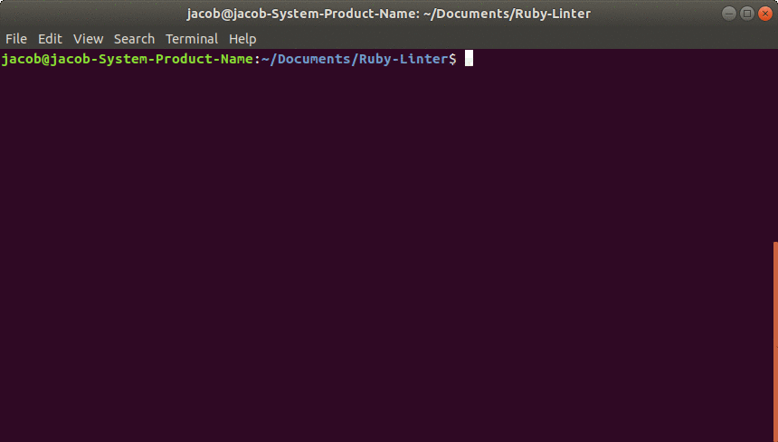

# Ruby-Linter

> This project is a challenge on building a Ruby Linter that detects errors within Ruby code and reports these erorrs to the user. This is part of the _Microverse Remote Software Development Curriculum_.

### DragonLintAlpha Screenshot:



# Getting Started
It is recomended that you use this project with ***Ruby version 2.7.0*** (support for older versions of Ruby not guaranteed) you should already have Ruby installed on your machine before you begin.

To get a local copy of the repository please run the following commands on your terminal:

```
$ cd <folder>
```

```
$ git clone git@github.com:jacobrees/Ruby-Linter.git
```

To launch DragonLintAlpha inside of your terminal you will need to navigate into the repository you have just cloned. You will do this by using `cd` inside of your terminal. Once you are inside of this folder run the command `bin/main.rb` and this will launch the program. 

Below shows the following commands you will need to run to achieve this:

```
$ cd Ruby-Linter
```

```
$ bin/main.rb
```

#### Rspec Testing (optional)

To test the code, run `rspec --format doc` from root of the folder using terminal.
> Rspec is used for the test.

To install Rspec if you do not already have Rspec installed run the bash command bellow
~~~bash
$ gem install rspec
~~~

# The Operations of This Linter

## 1. Layout

### Checks For Trailing Spaces

- Detects unnecessary spaces at the end of a line

#### good

```
  def example|
    puts 'example'|
  end|
```

#### bad

```
  def example |
    puts 'example' |
  end |
```


### Checks For Multiple Empty Lines

- Checks if there is more than one blank line in after the other.

#### good

```
  class Example
    def initialize(name)
      @name = name
    end
  end

   def example
    puts 'example'
  end
```

#### bad

```
  class Example
    def initialize(name)
      @name = name
    end
  end


  def example
    puts 'example'
  end
```

## 2. Naming

### Checks Variable Name

- Detects if variables are using proper snake_case for their names.

#### good

```
example_var = 0
```

#### bad

```
exampleVar = 0
```

### Checks Method Name

- Detects if methods are using proper snake_case for their names.

#### good

```
def example_method
  # code
end
```

#### bad

```
def ExampleMethod
  # code
end
```

### Checks Class Name

- Detects if classes are using proper PascalCase for their names.

#### good

```
class ExampleClass
  # code
end
```

#### bad

```
class example_class
  # code
end
```


### Checks Module Name

- Detects if Modules are using proper PascalCase for their names.

#### good

```
module ExampleModule
  # code
end
```

#### bad

```
module example_class
  # code
end
```

## Built With

- Ruby (Version - 2.7.0p0)

## Live Code

[View Live Code](https://repl.it)

## Authors

👤 **Jacob Rees**

- Github: [@jacobrees](https://github.com/jacobrees)
- Linkedin: [jacob-rees-a6507b1a6](https://www.linkedin.com/in/jacob-rees-a6507b1a6/)

## 🤝 Contributing

Contributions, issues and feature requests are welcome!

## Show your support

Give a ⭐️ if you like this project!

## Acknowledgments

- Project inspired by Microverse Program
